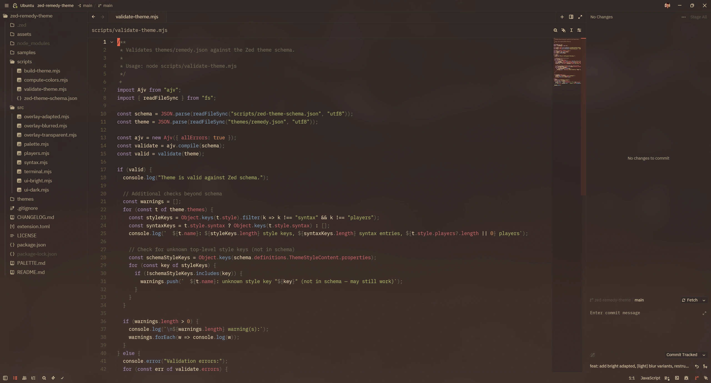
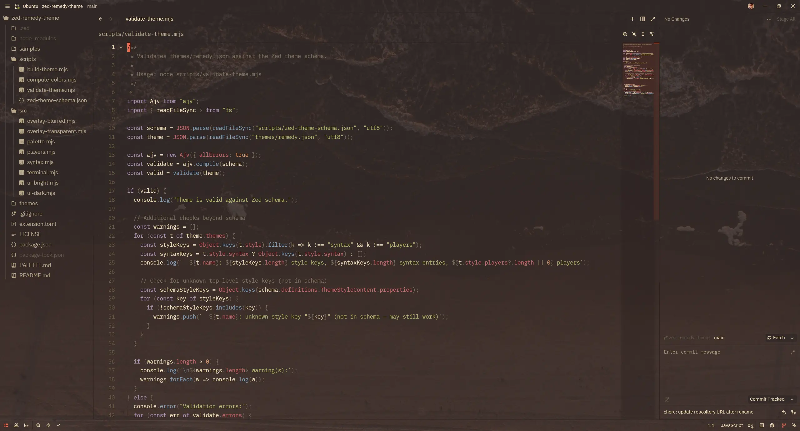
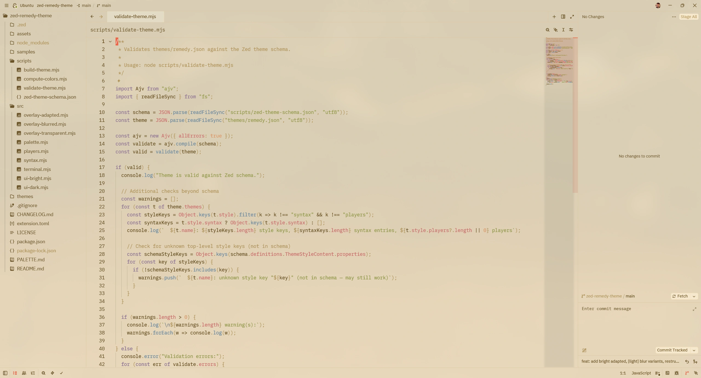
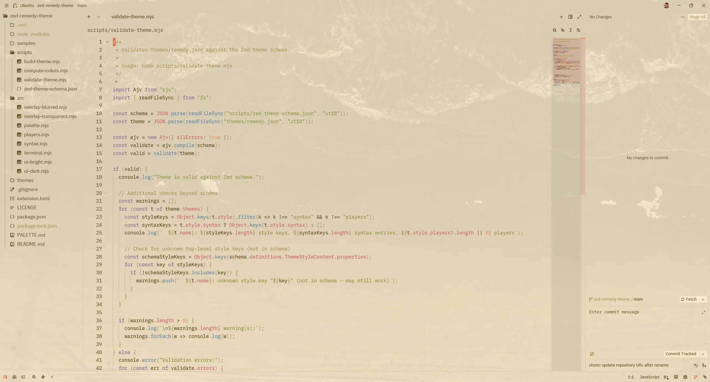

# Remedy Theme for Zed

[](https://zed.dev/extensions/remedy-theme)


A port of the [Remedy](https://github.com/robertrossmann/vscode-remedy) color scheme
for the [Zed](https://zed.dev) editor.

Remedy is a warm, comfortable color scheme with orange as its signature accent color,
rooted in the Base16 Eighties palette. It emphasizes cross-language color consistency
and a cohesive UI.

## Variants

The blurred and transparent variants use the OS compositor: NSVisualEffectView on
macOS, Acrylic (Win10 1809+) or Mica (Win11) on Windows. On Linux, transparency
works across compositors; blur requires KDE (via the `kde-blur` protocol) — on
GNOME and wlroots-based compositors (Hyprland, Sway, Niri), the window appears
transparent without blur.

<table>
  <tr>
    <th width="80"></th>
    <th width="33%">Opaque</th>
    <th width="33%">Blur</th>
    <th width="33%">Transparent</th>
  </tr>
  <tr>
    <th>Dark</th>
    <td><a href="assets/screenshots/dark-opaque.webp"></a></td>
    <td><a href="assets/screenshots/dark-blur.webp"></a></td>
    <td><a href="assets/screenshots/dark-transparent.webp"></a></td>
  </tr>
  <tr>
    <th>Bright</th>
    <td><a href="assets/screenshots/bright-opaque.webp"></a></td>
    <td><a href="assets/screenshots/bright-blur.webp"></a></td>
    <td><a href="assets/screenshots/bright-transparent.webp"></a></td>
  </tr>
</table>

Click any thumbnail to view the full-size image.

## Italic / "Tilted" Mode

The original Remedy theme for VS Code includes "Tilted" variants with italicized
keywords, strings, and comments — designed for fonts like Operator Mono. In Zed,
you can enable this on any variant via your settings:

```json
{
  "experimental.theme_overrides": {
    "syntax": {
      "comment": { "font_style": "italic" },
      "comment.doc": { "font_style": "italic" },
      "keyword": { "font_style": "italic" },
      "keyword.function": { "font_style": "italic" },
      "keyword.return": { "font_style": "italic" },
      "keyword.conditional": { "font_style": "italic" },
      "keyword.repeat": { "font_style": "italic" },
      "keyword.operator": { "font_style": "italic" },
      "keyword.import": { "font_style": "italic" },
      "keyword.export": { "font_style": "italic" },
      "keyword.modifier": { "font_style": "italic" },
      "keyword.type": { "font_style": "italic" },
      "keyword.exception": { "font_style": "italic" },
      "keyword.directive": { "font_style": "italic" },
      "string": { "font_style": "italic" },
      "string.doc": { "font_style": "italic" },
      "string.regex": { "font_style": "italic" },
      "string.special": { "font_style": "italic" },
      "attribute": { "font_style": "italic" },
      "tag.attribute": { "font_style": "italic" },
      "variable.parameter": { "font_style": "italic" },
      "parameter": { "font_style": "italic" }
    }
  }
}
```

## Installation

### From the Zed Extension Marketplace

1. Open Zed
2. Open the Extensions panel (or use the command palette)
3. Search for "Remedy"
4. Click Install

### Manual / Dev Installation

1. Clone this repository
2. In Zed, open the command palette and select "Install Dev Extension"
3. Point it to the cloned directory

## Attribution

This is an unofficial port of **Remedy** by
[Robert Rossmann](https://github.com/robertrossmann). All color palette choices
and design decisions originate from the
[original project](https://github.com/robertrossmann/vscode-remedy),
which is licensed under the BSD 3-Clause License.

This port adapts the theme for Zed's theme format, translating TextMate scopes
to Tree-sitter capture names and mapping VS Code UI color keys to Zed's style
properties. Color values are sourced from the Remedy v5.28.0 VS Code extension
build output.
