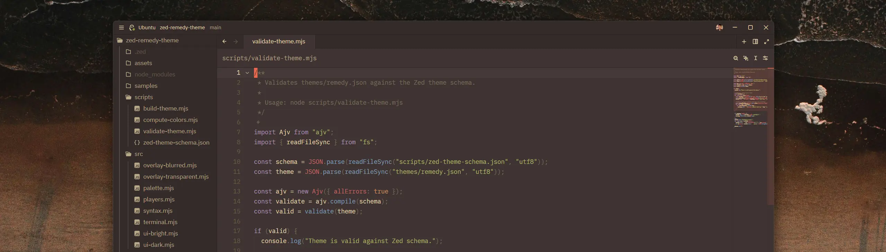
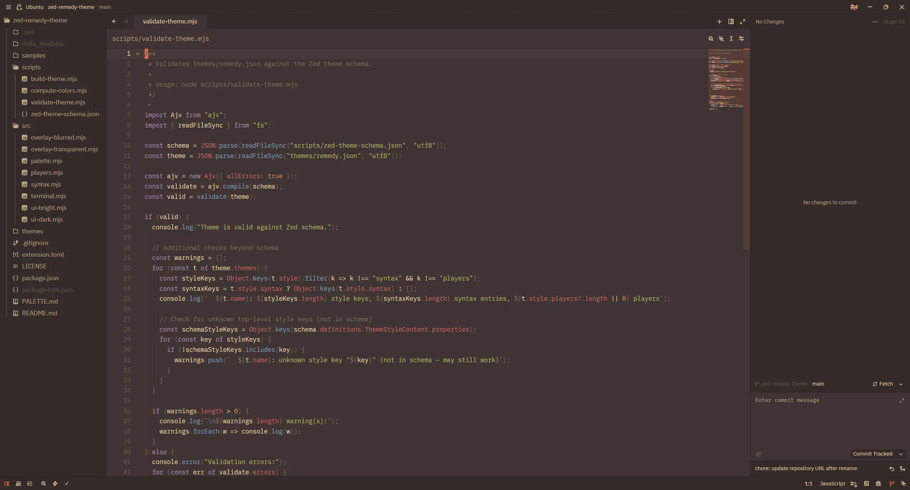
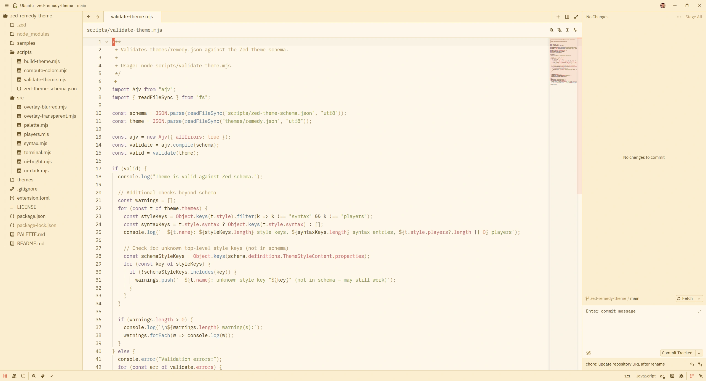

# Remedy Theme for Zed

<p align="center">
  <a href="https://zed.dev/extensions/remedy-theme"></a>
  <a href="LICENSE"></a>
</p>



A port of the [Remedy](https://github.com/robertrossmann/vscode-remedy) color scheme
for the [Zed](https://zed.dev) editor.

Remedy is a warm, comfortable color scheme with orange as its signature accent color,
rooted in the Base16 Eighties palette. It emphasizes cross-language color consistency
and a cohesive UI.

## Variants

The default dark and bright variants prioritize fidelity to the original Remedy
theme. The adapted variants keep the same syntax palette but adjust Zed's
chrome — `Remedy Dark (adapted)` lifts panel borders and tints the title/status
bar for clearer separation; `Remedy Bright (adapted)` shifts the title/status
bar to a slightly warmer band. Dark blur and transparent inherit the lighter
border treatment.

The blur and transparent variants use the OS compositor: NSVisualEffectView on
macOS, Acrylic (Win10 1809+) or Mica (Win11) on Windows. On Linux, transparency
works across compositors; blur requires KDE (via the `kde-blur` protocol). On
GNOME and wlroots-based compositors (Hyprland, Sway, Niri), the window appears
transparent without blur. The `[light]` blur variants drop chrome opacity from
~85% to ~60% for a more transparent feel.

<table>
  <tr>
    <th width="160"></th>
    <th width="50%">Dark</th>
    <th width="50%">Bright</th>
  </tr>
  <tr>
    <th>Default</th>
    <td><a href="assets/screenshots/dark-opaque.webp"></a></td>
    <td><a href="assets/screenshots/bright-opaque.webp"></a></td>
  </tr>
  <tr>
    <th>Adapted</th>
    <td><em>Screenshot coming soon</em></td>
    <td><em>Screenshot coming soon</em></td>
  </tr>
  <tr>
    <th>Blur</th>
    <td><em>Screenshot coming soon</em></td>
    <td><em>Screenshot coming soon</em></td>
  </tr>
  <tr>
    <th>Blur [light]</th>
    <td><em>Screenshot coming soon</em></td>
    <td><em>Screenshot coming soon</em></td>
  </tr>
  <tr>
    <th>Transparent</th>
    <td><em>Screenshot coming soon</em></td>
    <td><em>Screenshot coming soon</em></td>
  </tr>
</table>

Click any thumbnail to view the full-size image.

## Italic / "Tilted" Mode

The original Remedy theme for VS Code ships "Tilted" variants that italicize
keywords, storage types, strings, comments, and markup attributes. Zed does not
have separate Tilted themes; you can enable the same effect on any Remedy variant
via your settings.

<details>
<summary>Italic syntax override</summary>

```json
{
  "experimental.theme_overrides": {
    "syntax": {
      "comment": { "font_style": "italic" },
      "comment.doc": { "font_style": "italic" },
      "keyword": { "font_style": "italic" },
      "keyword.function": { "font_style": "italic" },
      "keyword.return": { "font_style": "italic" },
      "keyword.conditional": { "font_style": "italic" },
      "keyword.repeat": { "font_style": "italic" },
      "keyword.operator": { "font_style": "italic" },
      "keyword.import": { "font_style": "italic" },
      "keyword.export": { "font_style": "italic" },
      "keyword.modifier": { "font_style": "italic" },
      "keyword.type": { "font_style": "italic" },
      "keyword.exception": { "font_style": "italic" },
      "keyword.directive": { "font_style": "italic" },
      "string": { "font_style": "italic" },
      "string.doc": { "font_style": "italic" },
      "string.regex": { "font_style": "italic" },
      "string.special": { "font_style": "italic" },
      "attribute": { "font_style": "italic" },
      "tag.attribute": { "font_style": "italic" },
      "variable.parameter": { "font_style": "italic" },
      "parameter": { "font_style": "italic" }
    }
  }
}
```

</details>

The effect shines with fonts that include a genuine italic face such as JetBrains
Mono, Cascadia Code Italic, Monaspace Radon, Victor Mono, MonoLisa, or Operator
Mono. Use the default variants if your font lacks italics or you prefer upright
syntax.

## Installation

### From the Zed Extension Marketplace

Install directly from [the extension page](https://zed.dev/extensions/remedy-theme),
or search "Remedy" in Zed's Extensions panel.

### Manual / Dev Installation

1. Clone this repository
2. In Zed, open the command palette and select "Install Dev Extension"
3. Point it to the cloned directory

## Attribution

This is an unofficial port of **Remedy** by
[Robert Rossmann](https://github.com/robertrossmann). All color palette choices
and design decisions originate from the
[original project](https://github.com/robertrossmann/vscode-remedy),
which is licensed under the BSD 3-Clause License.

This port adapts the theme for Zed's theme format, translating TextMate scopes
to Tree-sitter capture names and mapping VS Code UI color keys to Zed's style
properties. Color values are sourced from the Remedy v5.28.0 VS Code extension
build output.

---

*Hero image wallpaper by [Karolis Milišauskas](https://unsplash.com/@karolismili) on Unsplash.*
